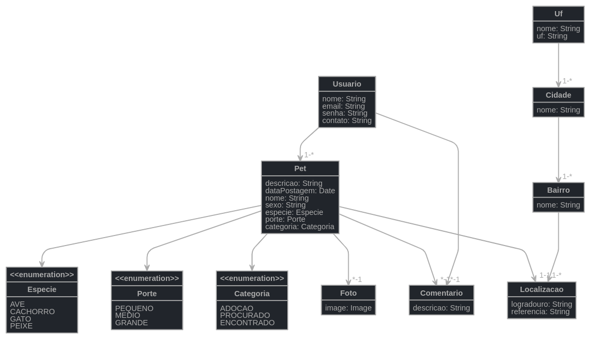

# Bumblebee - backend
O Bumblebee Pets é uma plataforma web para publicação e busca de animais perdidos, achados ou
disponíveis para adoção, foi desenvolvido junto ao curso Academia Dev Joinville ofertado pela Code:Nation em parceria com Asaas, 
Becomex, Conta Azul e Treasy. Este projeto foi desenvolvido com objetivo de aplicar os conceitos aprendidos em aula durante o andamento do curso. 

Neste repositório está armazenado o código-fonte do backend do projeto. 
As tecnologias utilizadas, a organização do time de desenvolvimento e 
demais informações do projeto podem ser encontradas no 
[repositório Wiki](https://github.com/academiadev-jlle/wiki-bumblebee/blob/master/home.md).

### Equipe backend
  * **Bruno Miguel Morais** [Linkedin](https://www.linkedin.com/in/bruno-m-morais/) | [GitHub](https://github.com/bmorais21)
  * **Vinícius de Oliveira** [Linkedin](https://www.linkedin.com/in/vinicius-o-bsi/) | [GitHub](https://github.com/viniciusbsi)

### Modelagem do banco de dados

### Download do projeto
Obs: Os comandos utilizados neste tutorial de instalação serão compatíveis com sistemas 
operacionais Linux. 

Faça o clone do projeto através do link:

`https://github.com/academiadev-jlle/backend-bumblebee.git`

Para executar o projeto, vá ao diretório `/backend/bumblebee` e instale as 
dependências conforme descrito a seguir:

#### Instalação do Gradle
É necessário ter instalado o JDK 8 para efetuar a instalação do Gradle. 
Verifique se o Java está instalado com o comando `java -version`. 
O retorno deve ser semelhante a "java version "1.8.0_121".

Após, verifique se o SDK está instalado no seu computador com o comando
`sdk version`. Caso não for encontrado a ferramenta, instale-a utilizando 
os seguintes comandos:

`curl -s "https://get.sdkman.io" | bash`

`source "$HOME/.sdkman/bin/sdkman-init.sh"`

Após, execute o comando para a instalação do Gradle:

`sdk install gradle 4.10.2`

Após a instalação, execute o comando `gradle bootRun` no diretório do projeto. Quando o servidor 
informar que o processo está rodando na porta 8080, você pode acessar o link 
abaixo para visualizar a documentação do Swagger e utilizar os métodos 
descritos na seção de Especificação.

`http://localhost:8080/swagger-ui.html`
